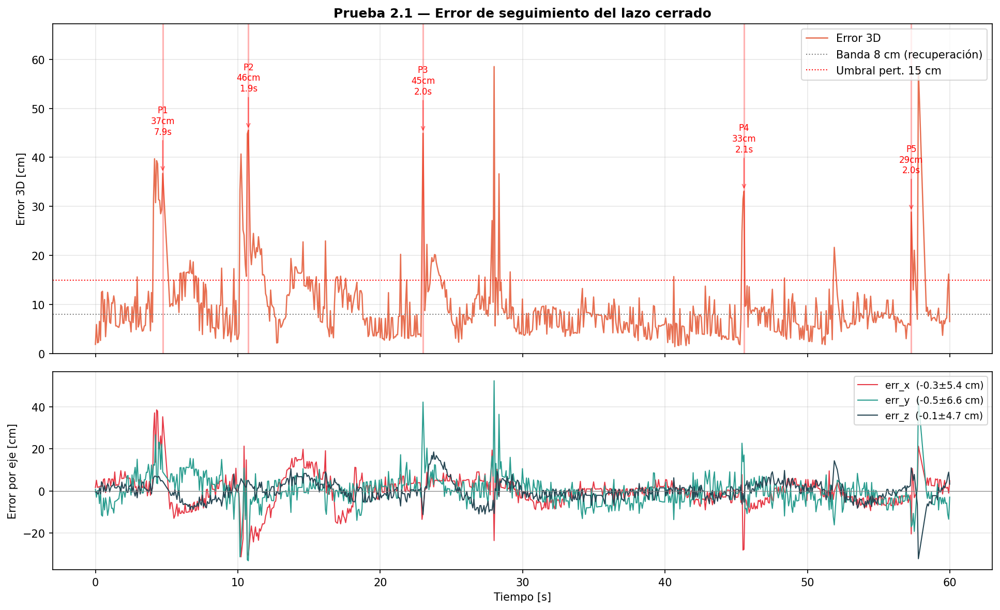
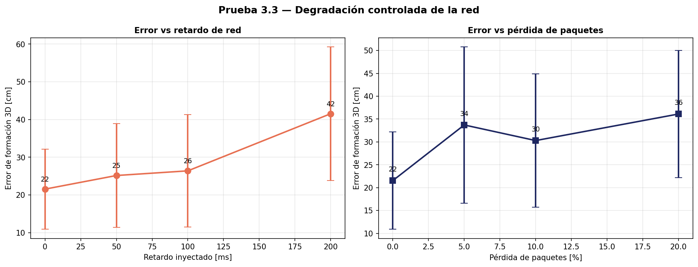
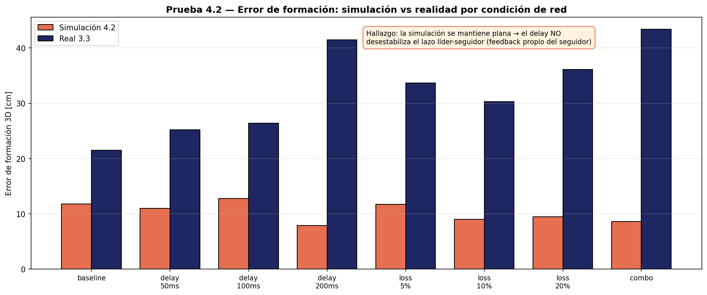

# Sistema Cooperativo de Drones basado en Modelos Dinámicos y Redes Ad-Hoc

> Proyecto de grado — **Universidad de los Andes**, Departamento de Ingeniería de Sistemas y Computación.
> Autor: **Juan Felipe Ledesma Velásquez** · Asesores: **Camilo Andrés Escobar Velásquez, PhD.** y ** Jonathan Camargo Leyva, PhD.** · 2026.

Validación experimental de **control cooperativo de dos drones de bajo costo** (Ryze/DJI Tello)
coordinados mediante una **red Ad-Hoc** (enlace Ethernet entre dos computadores) y localizados
por **visión con marcadores ArUco**. El proyecto ejecutó las **16 pruebas** de un plan experimental
distribuido en 5 objetivos (OE1–OE5): identificación dinámica, control en lazo cerrado, formación
líder-seguidor, consenso distribuido, caracterización de red, simulación y una misión integral
repetible.

Este repositorio está pensado para que **otra persona pueda retomarlo y construir sobre él**: incluye
el código completo, los datos crudos de cada experimento, las figuras del informe, y documentación
de *por qué* cada componente se implementó como está (incluyendo lo que **no** funcionó).

---

## Tabla de contenido

- [Resultados de un vistazo](#resultados-de-un-vistazo)
- [Arquitectura del sistema](#arquitectura-del-sistema)
- [Estructura del repositorio](#estructura-del-repositorio)
- [Inicio rápido](#inicio-rápido)
- [Las 16 pruebas](#las-16-pruebas)
- [Documentación detallada](#documentación-detallada)
- [Limitaciones conocidas](#limitaciones-conocidas)
- [Cómo citar](#cómo-citar)
- [Licencia](#licencia)

---

## Resultados de un vistazo

| Dimensión | Resultado |
|---|---|
| Modelo dinámico del Tello | 2.º orden: ωₙ ≈ 1.9 rad/s, ζ ≈ 1.0, RMSE de ajuste 2.79 cm |
| Lazo cerrado individual (ArUco) | Error 3D estacionario **8.1 cm**; sesgo < 1 cm por eje |
| Formación estática líder-seguidor | Error 3D **12.9 cm** (con filtro N=8; 27.4 cm sin él) |
| Formación dinámica | Error 3D promedio **23 cm** (15 cm en hover, 28 cm navegando) |
| Consenso distribuido | Distancia inter-dron **60.6 ± 6.4 cm** (separación de seguridad respetada) |
| Enlace Ethernet | RTT 1.54 ms · throughput 93.3 Mbps · 0 % pérdida |
| Protocolo binario | 41 bytes (4× más compacto que JSON), **0 errores CRC en >50 000 mensajes** |
| Misión cooperativa integral | **87.5 % de éxito** (7/8 reps), duración 71.3 ± 2.3 s |
| Hallazgo de simulación | El retardo de red **no** desestabiliza al seguidor (cierra su lazo con feedback propio) |

Las 16 figuras del informe están en [`presentation_assets/`](presentation_assets/). Por ejemplo:

| Lazo cerrado (2.1) | Degradación de red (3.3) | Sim vs real (4.2) |
|---|---|---|
|  |  |  |

---

## Arquitectura del sistema

La cooperación **no** ocurre entre los drones directamente: cada Tello crea su propia red WiFi y solo
acepta un cliente, por lo que **no se pueden poner dos Tello en la misma red**. La coordinación se
materializa en la capa de los **computadores**, unidos por un cable Ethernet directo que actúa como
backbone Ad-Hoc.

```
        Pared con 6 marcadores ArUco (grid 3×2, 48 cm c/u)
   ┌───────────────────────────────────────────────────────┐
   │   [1]      [3]      [5]      ← fila alta  (Y = 1.4 m)   │
   │   [0]      [2]      [4]      ← fila baja  (Y = 0.4 m)   │
   └───────────────────────────────────────────────────────┘
        ▲ cámara                       ▲ cámara
        │ (visión ArUco)               │ (visión ArUco)
     ┌──────┐                       ┌──────┐
     │TelloA│  WiFi  ┄┄┄┄┄┄┄┄┄      │TelloB│  WiFi  ┄┄┄┄┄┄┄┄┄
     └──────┘         ┊             └──────┘         ┊
         ▲            ┊                 ▲            ┊
         │ SDK/UDP    ┊                 │ SDK/UDP    ┊
   ┌─────────────┐    ┊           ┌──────────────┐   ┊
   │ MASTER (Mac)│════╪═══════════│ SLAVE (Ubuntu)│  ┊
   │ 192.168.1.1 │  Ethernet      │ 192.168.1.2   │
   │  (líder)    │  UDP :5005     │  (seguidor)   │
   └─────────────┘  binario+CRC16 └──────────────┘
```

- **Localización:** cada dron estima su pose mundo detectando el marcador ArUco más cercano al centro
  de su imagen (`cv2.SOLVEPNP_IPPE_SQUARE`) y un filtro temporal de *outliers*.
- **Control:** PID de posición por eje (error en metros → comando `rc_control` en escala ±30).
- **Comunicación:** mensaje binario de 41 bytes con CRC-16/CCITT a 20–50 Hz sobre UDP.
- **Cooperación:** el seguidor calcula su objetivo como `pose_líder + offset` y cierra **su propio**
  lazo con su cámara — clave para entender por qué el retardo de red no lo desestabiliza.

Detalle completo en [`docs/ARCHITECTURE.md`](docs/ARCHITECTURE.md).

---

## Estructura del repositorio

```
.
├── README.md                     ← este archivo
├── requirements.txt              ← dependencias Python
├── config.py                     ← parámetros centrales (IPs, markers, PID, formación, seguridad)
│
├── test_1_1_step_response.py     ← OE1: respuesta escalón (1 dron)
├── test_1_2_latency.py           ← OE1: latencia comando-acción
├── test_1_3_hover.py             ← OE1: caracterización del hover
├── test_2_1_closed_loop.py       ← OE2: lazo cerrado ArUco (1 dron)
├── test_2_2_master.py / _slave.py← OE2: formación estática líder-seguidor
├── test_2_3_master.py / _slave.py← OE2: formación dinámica (trayectoria)
├── test_2_4_consensus.py         ← OE2: consenso distribuido (--id 1|2)
├── test_3_1_ethernet.py          ← OE3: benchmark del enlace
├── test_3_2_protocol.py          ← OE3: protocolo binario vs JSON
├── test_3_3_master.py/_slave.py/_inject.py ← OE3: degradación de red (tc/netem + IFB)
├── test_3_4_master.py / _slave.py← OE3: tolerancia a fallas de comunicación
├── test_4_1_simulation.py        ← OE4: simulación de la formación dinámica
├── test_4_2_simulation.py        ← OE4: simulación con degradación de red
├── test_5_1_master.py / _slave.py← OE5: misión cooperativa completa (7 fases)
│
├── utils/
│   ├── aruco.py                  ← ArUcoTracker (single-marker + IPPE + outlier filter)
│   ├── pid.py                    ← PIDController con anti-windup
│   ├── comms.py                  ← envío/recepción UDP (versión JSON de referencia)
│   └── logger.py                 ← FlightLogger a CSV
│
├── generate_aruco_markers.py     ← genera los PNG de los 6 marcadores
├── generate_chessboard.py        ← genera el patrón de calibración
├── calibrate_camera.py           ← calibración de cámara (descartada — ver docs)
├── analyze_for_presentation.py   ← figuras de OE1 + 2.1 (lee logs/, escribe presentation_assets/)
├── generate_all_figures.py       ← las 10 figuras restantes (2.2–5.2)
│
├── aruco_markers/                ← marcadores listos para imprimir + chessboard
├── logs/                         ← DATOS CRUDOS de todas las corridas (CSV/JSON)
├── presentation_assets/          ← las 16 figuras del informe (PNG)
│
├── HANDOFF.md                    ← bitácora técnica completa del desarrollo
├── Informe_Tesis_Drones_Cooperativos.docx ← informe de resultados (con figuras)
└── docs/                         ← documentación de este repositorio (ver abajo)
```

> **Nota:** `venv/` y `calibration_captures/` (62 MB de capturas de una calibración descartada) están
> excluidos por `.gitignore`. Los videos cenitales de la prueba 5.3 tampoco se versionan por tamaño.

---

## Inicio rápido

### 1. Reproducir el análisis y las figuras (sin hardware)

Todo el procesamiento de datos es **autocontenido**: los CSV/JSON crudos están en `logs/`.

```bash
git clone <URL-del-repo>
cd "drone_tests 2"

python3 -m venv venv
source venv/bin/activate            # Windows: venv\Scripts\activate
pip install -r requirements.txt

# Regenera las 16 figuras del informe a partir de los datos crudos:
python analyze_for_presentation.py   # OE1 + 2.1  → presentation_assets/
python generate_all_figures.py       # 2.2 … 5.2  → presentation_assets/

# Corre las simulaciones de OE4 (no requieren drones):
python test_4_1_simulation.py
python test_4_2_simulation.py
```

### 2. Volar las pruebas con hardware

Requiere 2 drones Tello, 2 computadores, el cable Ethernet y los marcadores impresos.
**Lee primero** [`docs/SETUP.md`](docs/SETUP.md) (red, marcadores, IPs) y
[`docs/REPLICATION.md`](docs/REPLICATION.md) (procedimiento paso a paso por prueba y reglas de
seguridad). Resumen mínimo de una prueba cooperativa:

```bash
# En el SLAVE (Ubuntu) — SIEMPRE primero:
python test_2_2_slave.py
# En el MASTER (Mac) — después:
python test_2_2_master.py
```

---

## Las 16 pruebas

| OE | # | Prueba | Drones | Script(s) |
|----|---|--------|:------:|-----------|
| 1 | 1.1 | Respuesta escalón | 1 | `test_1_1_step_response.py` |
| 1 | 1.2 | Latencia comando-acción | 1 | `test_1_2_latency.py` |
| 1 | 1.3 | Caracterización del hover | 1 | `test_1_3_hover.py` |
| 2 | 2.1 | Lazo cerrado ArUco | 1 | `test_2_1_closed_loop.py` |
| 2 | 2.2 | Formación estática | 2 | `test_2_2_master.py` + `_slave.py` |
| 2 | 2.3 | Formación dinámica | 2 | `test_2_3_master.py` + `_slave.py` |
| 2 | 2.4 | Consenso distribuido | 2 | `test_2_4_consensus.py --id {1,2}` |
| 3 | 3.1 | Benchmark Ethernet | 0 | `test_3_1_ethernet.py` |
| 3 | 3.2 | Protocolo de mensajes | 0 | `test_3_2_protocol.py` |
| 3 | 3.3 | Degradación de red | 2 | `test_3_3_master/_slave/_inject.py` |
| 3 | 3.4 | Tolerancia a fallas | 2 | `test_3_4_master.py` + `_slave.py` |
| 4 | 4.1 | Simulación formación | 0 | `test_4_1_simulation.py` |
| 4 | 4.2 | Simulación con degradación | 0 | `test_4_2_simulation.py` |
| 5 | 5.1 | Misión cooperativa completa | 2 | `test_5_1_master.py` + `_slave.py` |
| 5 | 5.2 | Repetibilidad (8 reps) | 2 | (repite 5.1) |
| 5 | 5.3 | Registro visual cenital | 2 | (cámara externa) |

Procedimiento y resultados de cada una en [`docs/REPLICATION.md`](docs/REPLICATION.md) y
[`docs/RESULTS.md`](docs/RESULTS.md).

---

## Documentación detallada

| Documento | Contenido |
|---|---|
| [`docs/ARCHITECTURE.md`](docs/ARCHITECTURE.md) | Capas del sistema, flujo de datos, protocolo binario, sistema de coordenadas. |
| [`docs/SETUP.md`](docs/SETUP.md) | Hardware, red Ethernet de dos PC (IP persistente), impresión y montaje de marcadores. |
| [`docs/REPLICATION.md`](docs/REPLICATION.md) | Cómo correr cada prueba paso a paso; setup de `tc/netem`+IFB; reglas de seguridad. |
| [`docs/DESIGN_DECISIONS.md`](docs/DESIGN_DECISIONS.md) | **Por qué** cada decisión, y catálogo de lo que **no** funcionó (oro metodológico). |
| [`docs/TELLO_EDU.md`](docs/TELLO_EDU.md) | Cómo se haría con **Tello EDU** (modo estación / SDK 3.0 / enjambre) y qué cambiaría. |
| [`docs/RESULTS.md`](docs/RESULTS.md) | Resultados numéricos completos por prueba, con las figuras. |
| [`docs/FUTURE_WORK.md`](docs/FUTURE_WORK.md) | Mejoras concretas, incluido el prototipo de dron propio (XIAO ESP32S3 + PCA9685). |

La bitácora cronológica del desarrollo está en [`HANDOFF.md`](HANDOFF.md).

---

## Limitaciones conocidas

- La localización depende de **marcadores ArUco fijos**: el sistema no opera fuera del área instrumentada.
- La cámara usa **parámetros aproximados**; la calibración formal con chessboard fue descartada (ver
  [`docs/DESIGN_DECISIONS.md`](docs/DESIGN_DECISIONS.md)).
- Probado con **2 drones**; la escalabilidad a flotas mayores no se evaluó experimentalmente.
- La simulación de OE4 usa un modelo simplificado que **subestima los transitorios** dinámicos.
- OE4 se implementó en **Python** (no Gazebo); ver la nota de justificación en `docs/FUTURE_WORK.md`.

---

## Cómo citar

```bibtex
@mastersthesis{ledesma2026drones,
  author = {Ledesma Velásquez, Juan Felipe},
  title  = {Sistema Cooperativo de Drones basado en Modelos Dinámicos y Redes Ad-Hoc},
  school = {Universidad de los Andes, Departamento de Ingeniería de Sistemas y Computación},
  year   = {2026},
  type   = {Proyecto de grado}
}
```

---

## Licencia

Código liberado bajo licencia [MIT](LICENSE). Los datos experimentales en `logs/` se comparten con
fines académicos y de reproducibilidad.
