# Resultados experimentales

Resultados numéricos de las 16 pruebas, con las figuras correspondientes (en
[`../presentation_assets/`](../presentation_assets/)). El informe completo en prosa está en
`Informe_Tesis_Drones_Cooperativos.docx`. Los datos crudos están en [`../logs/`](../logs/) y todas las
figuras se regeneran con `analyze_for_presentation.py` y `generate_all_figures.py`.

---

## OE1 — Validación del modelo dinámico

### 1.1 Respuesta escalón
12 respuestas escalón (3 reps × 4 ejes, objetivo ±30 cm). Modelo de 2.º orden ajustado:
**K = 42.4 cm, ζ ≈ 1.0 (críticamente amortiguado), ωₙ ≈ 1.89 rad/s, RMSE = 2.79 cm**.

| Comando | Desplaz. real (cm) | Overshoot (cm) | Error final (cm) |
|---|---|---|---|
| Derecha (+X) | +29.2 ± 12.6 | 9.0 | −0.4 ± 12.3 |
| Arriba (+Y) | +30.8 ± 5.6 | 12.5 | −4.6 ± 9.7 |
| Izquierda (−X) | −30.6 ± 11.2 | 18.4 | −7.8 ± 17.7 |
| Abajo (−Y) | −36.1 ± 9.4 | 19.0 | −3.0 ± 1.0 |

El Tello muestra variabilidad de ±15–20 % en comandos discretos.

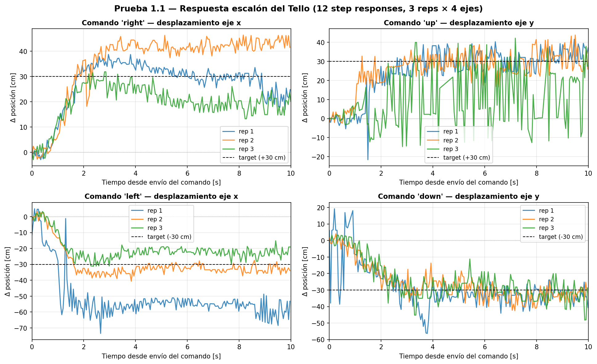
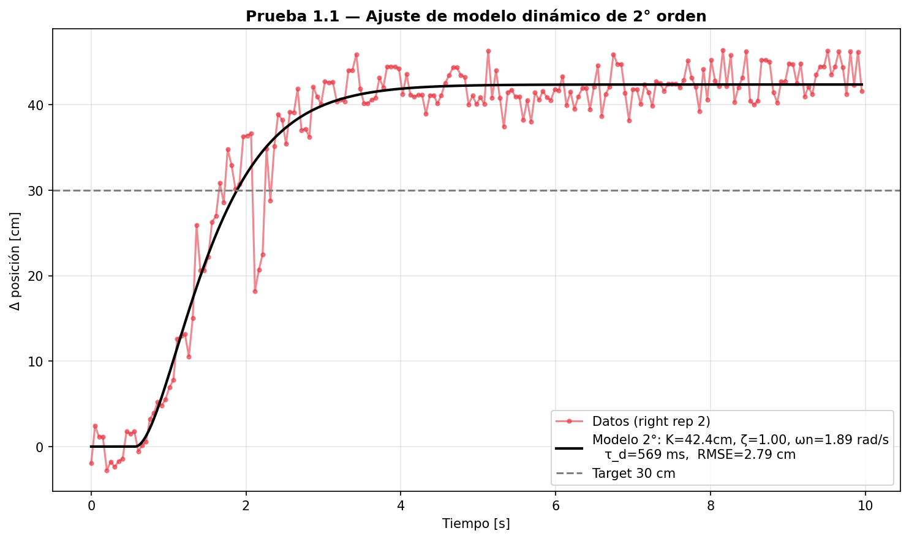

### 1.2 Latencia comando-acción
`move_*` discretos: media **1 203 ms** (σ 423 ms, mediana 1 029 ms, rango 679–2 045 ms). Incluye
latencia de firmware + tiempo de recorrer el umbral de detección. **Conclusión: inviable para lazo
cerrado** → todo lo cooperativo usa `rc_control`.

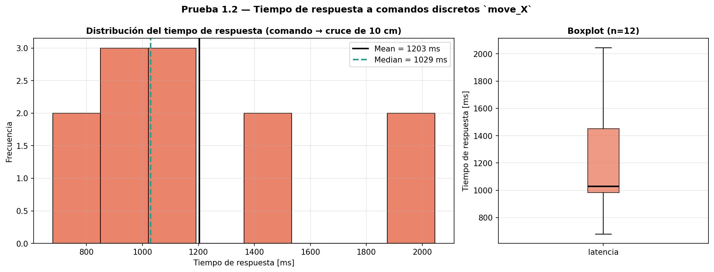

### 1.3 Hover libre (60 s, sin control)
σ_x = 4.3 cm, σ_y = 5.5 cm, σ_z = 3.7 cm. **Deriva máxima horizontal: 44.7 cm en 60 s**
(random walk lento). El ToF (sonar) reportó altitud muy estable (σ = 2.15 cm). Justifica el lazo cerrado.

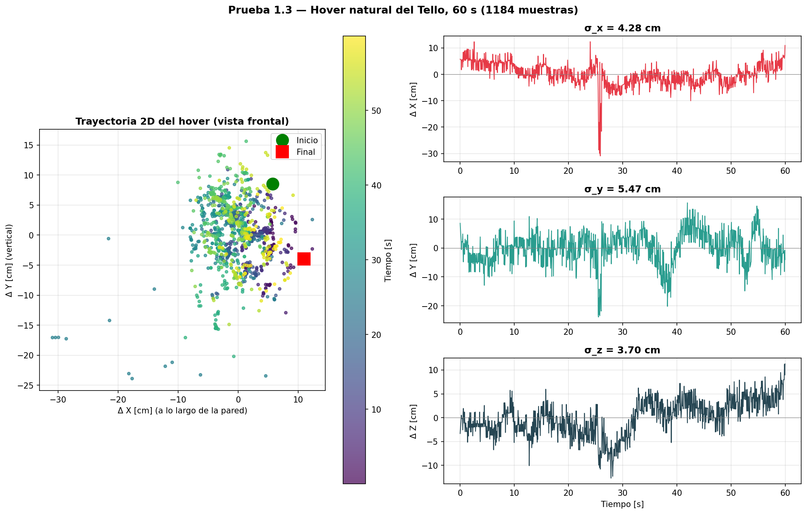

---

## OE2 — Control cooperativo

### 2.1 Lazo cerrado ArUco (1 dron)
Error 3D estacionario **8.1 cm**; por eje: x = −0.34 ± 5.4, y = −0.53 ± 6.6, z = −0.09 ± 4.7 cm (sesgo
< 1 cm). Lazo a **13.6 Hz**. Ante perturbaciones físicas (cartón, picos 33–46 cm), recuperación en
**1.85–2.13 s**.

### 2.2 Formación estática
Error 3D estacionario **12.9 cm** con filtro de promedio móvil N=8 (**27.4 cm sin filtro**, −53 %).
Sesgo < 3 cm por eje. 0 errores CRC en 3 005 mensajes, latencia 5.6 ms.

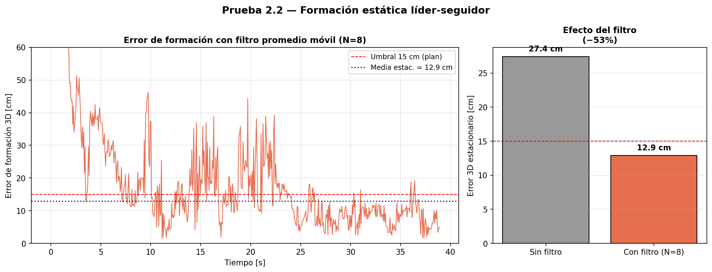

### 2.3 Formación dinámica (cuadrado)
Error 3D promedio **23 cm**: ~15 cm en hover en waypoints, ~28 cm navegando, picos de 50–90 cm en las
esquinas (lag del filtro N=8). 0 errores CRC en 3 937 mensajes.

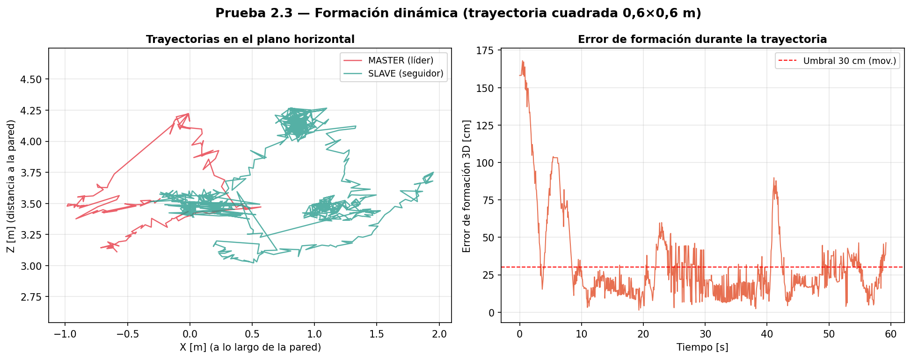

### 2.4 Consenso distribuido
Distancia inter-dron en estado estacionario **60.6 ± 6.4 cm** (= separación mínima diseñada), error al
objetivo individual 5 cm, 0 errores CRC en 4 836 mensajes bidireccionales. **El primer intento (consenso
clásico a punto único) provocó colisión por apilamiento vertical** → se añadió la separación mínima.

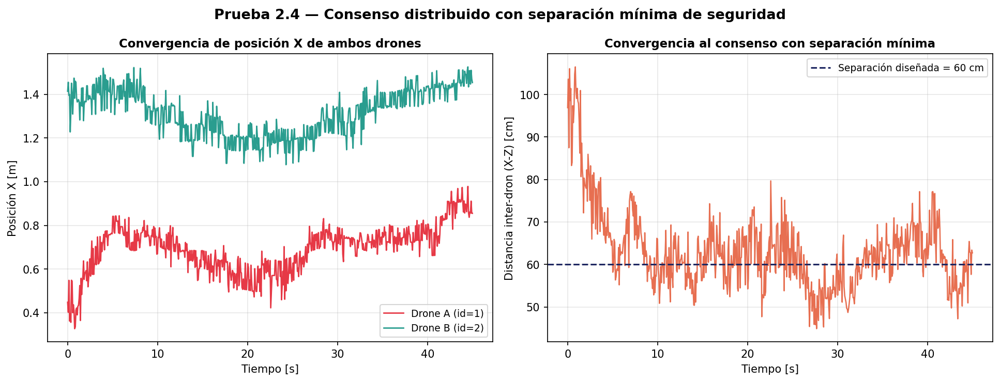

---

## OE3 — Red Ad-Hoc

### 3.1 Benchmark del enlace
Ping RTT **1.54 ms**, 0 % pérdida. Throughput iperf3 **93.3 Mbps**. UDP de cooperación a 10/25/50 Hz:
RTT 2.1–2.4 ms, jitter < 0.7 ms, 0 % pérdida. El enlace **no es cuello de botella** (0.02 % del ancho de
banda a 50 Hz).

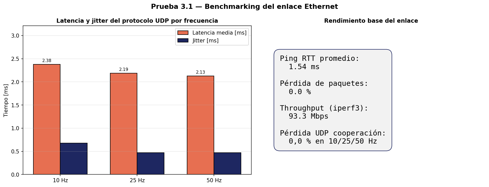

### 3.2 Protocolo de mensajes
Binario **41 B** vs JSON **162 B** (4× más compacto). Encode binario ~16 µs vs JSON ~89 µs (3–5× más
rápido con CRC en C). 100 % integridad CRC.

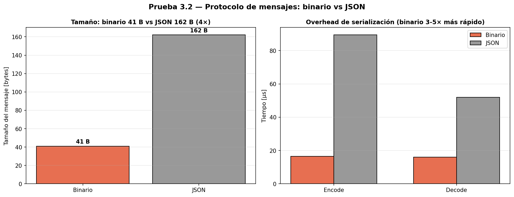

### 3.3 Degradación controlada de la red
8 condiciones, ~25 s c/u, durante formación estática. 0 errores CRC en 12 421 mensajes (incluso con
20 % de pérdida).

| Condición | err_3d (cm) | Δ vs baseline |
|---|---|---|
| baseline | 21.5 ± 10.6 | — |
| delay 50 ms | 25.2 ± 13.8 | +17 % |
| delay 100 ms | 26.4 ± 14.9 | +23 % |
| **delay 200 ms** | **41.5 ± 17.7** | **+93 %** |
| loss 5 % | 33.7 ± 17.1 | +57 % |
| loss 10 % | 30.3 ± 14.6 | +41 % |
| loss 20 % | 36.1 ± 13.9 | +68 % |
| **combo 100 ms + 10 %** | **43.4 ± 16.6** | **+102 %** |

Hallazgos: curva no lineal (salto crítico 100→200 ms); la pérdida es más tolerable que el delay; el
combo es peor que aditivo. **Pero** la simulación 4.2 demuestra que el delay *puro* no causa esto (ver
abajo).

### 3.4 Tolerancia a fallas
3 desconexiones (8/10/18 s) → desplazamiento 39/52/100 cm. **Deriva en hover seguro ≈ 5 cm/s**, escala
linealmente con la duración (consistente con el hover libre de 1.3). Hover seguro activado al timeout de
5 s. 0 errores CRC en 3 348 mensajes.

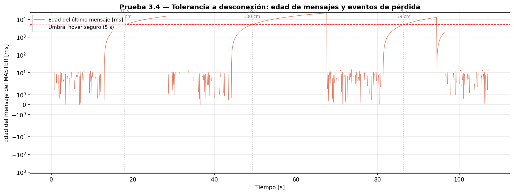

---

## OE4 — Simulación (Python, sobre el modelo identificado en OE1)

### 4.1 Replicación de la formación dinámica
Error de formación simulado **12.2 cm**. Brecha sim-to-real: **19 %** vs el estado estable de la 2.3
real (~15 cm); 47 % vs el promedio global (~23 cm, con transitorios). El simulador predice bien el
estado estable pero **subestima los transitorios** en cambios de dirección.

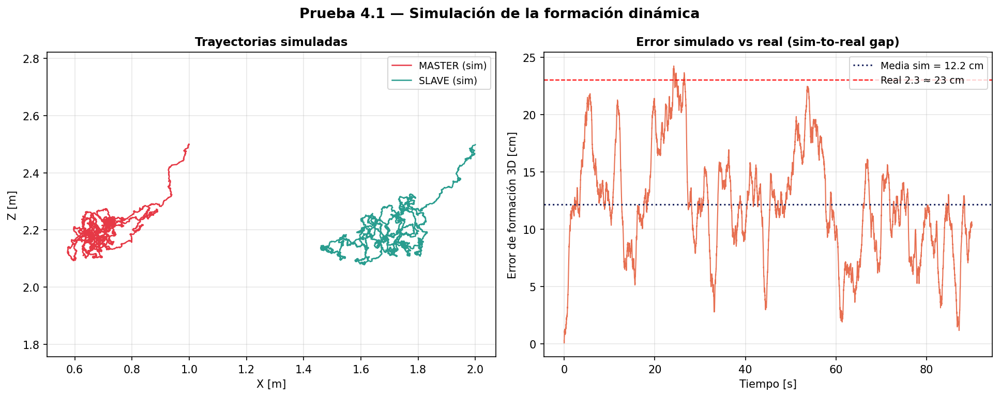

### 4.2 Simulación con degradación de red
**Hallazgo principal:** el error simulado se mantiene **plano (8–13 cm)** ante cualquier delay/loss. En
la arquitectura líder-seguidor, el seguidor cierra su lazo con feedback **propio**; el retardo afecta
solo la consigna, no la realimentación → no desestabiliza. Implica que la degradación real de la 3.3 se
debe a **factores concurrentes**, no al retardo de red en sí. La simulación sirve como herramienta de
**diagnóstico**.

---

## OE5 — Integración y validación

### 5.1 / 5.2 Misión cooperativa completa + repetibilidad (8 reps)
7 fases secuenciales con aterrizaje secuencial. **7/8 reps exitosas (87.5 %)**; la fallida fue por IMU
del seguidor mal calibrado (condición de borde conocida).

| Métrica (7 reps válidas) | Media ± std |
|---|---|
| Duración de la misión | **71.3 ± 2.3 s** (variabilidad < 3 %) |
| MASTER err_3d promedio | **11.6 ± 1.0 cm** |
| MASTER err_3d máximo | 57.9 ± 4.6 cm |
| SLAVE err_3d estacionario | **18.6 ± 3.0 cm** |
| SLAVE err_3d máximo | 107.1 ± 12.6 cm (transitorios) |
| SLAVE sesgo por eje entre reps | < 1 cm en X, Y, Z |
| Consumo de batería por misión | 14.3 ± 4.3 % |
| **Integridad de comunicación** | **0 errores CRC / 20 719 mensajes** |

Hallazgo: `WAIT_SLAVE_S` debe ser ≥ 25 s (el seguidor tarda ~15–18 s en entrar al lazo). El IMU
calibrado es prerrequisito crítico.

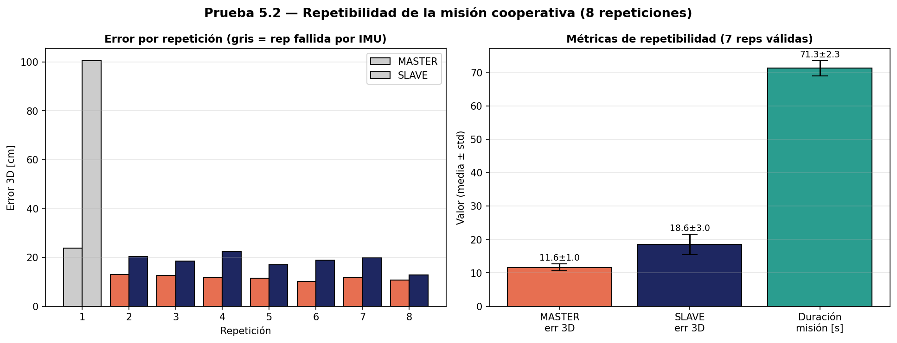

### 5.3 Registro visual cenital
8 videos grabados con cámara externa durante las repeticiones de 5.2, como *ground truth* visual
independiente del ArUco (no versionados por tamaño).

---

## Datos crudos

Cada corrida quedó registrada en [`../logs/`](../logs/) (CSV de vuelo, JSON de las pruebas 3.1/3.2).
Los CSV usados por las figuras incluyen los del SLAVE (`test_2_2_slave_*`, `test_2_3_slave_*`,
`test_3_3_slave_*`, `test_3_4_slave_*`), del MASTER y de consenso, además de `test_4_1_simulation.csv`.
